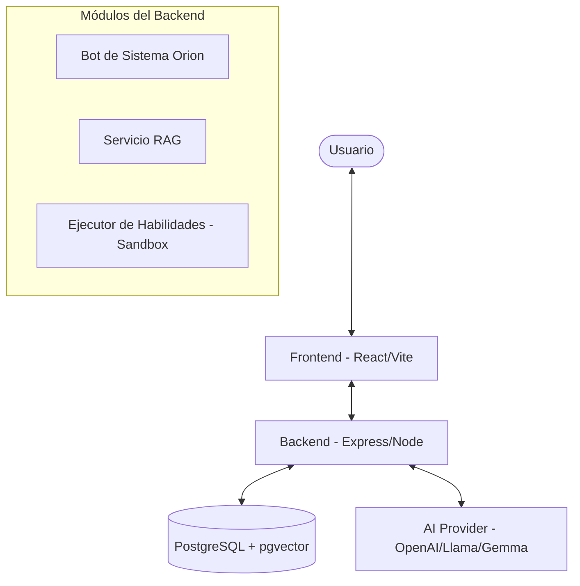

# Davinovate AI Orchestrator 🚀

**Davinovate AI Orchestrator** es una plataforma de orquestación de IA de nivel premium diseñada para crear, gestionar y desplegar agentes inteligentes 100% configurables. Permite la integración de conocimiento personalizado (RAG), habilidades programables y una interfaz de usuario de última generación para una interacción fluida entre humanos e IA.

---

## 🏗️ Descripción de la Arquitectura



---

## 🌟 Características Clave

> [!TIP]
> **Asistente Orion:** Utiliza el bot del sistema integrado para navegar por la interfaz de usuario, crear agentes y buscar en la web utilizando lenguaje natural.

- **Multitenencia Estricta**: Aislamiento completo de datos mediante autenticación JWT. Los usuarios solo acceden a sus propios recursos.
- **Motor RAG (Generación Aumentada por Recuperación)**: Sube archivos PDF/TXT para dotar a tus agentes de memoria especializada a largo plazo.
- **Habilidades Dinámicas (Skills)**: Programa tus propias herramientas en JavaScript y permite que los agentes decidan de forma autónoma cuándo invocarlas.
- **Extracción Web (Web Scraping)**: Orion puede obtener y resumir información directamente de cualquier enlace web en tiempo real.
- **Soporte Multilingüe**: Totalmente localizado en **Español** e **Inglés**.
- **Sandbox Seguro**: Ejecución aislada de habilidades de código mediante `vm` en Node.js para máxima seguridad.

---

## 🛠️ Stack Tecnológico

| Componente | Tecnologías Utilizadas |
| :--- | :--- |
| **Frontend** | React, Vite, Tailwind CSS, Framer Motion, Zustand |
| **Backend** | Node.js, Express, TypeScript, Axios, Cheerio |
| **Base de Datos** | PostgreSQL con la extensión `pgvector` |
| **Seguridad** | Helmet, Rate Limit, Sanitización XSS, JWT |

---

## 🚀 Guía de Despliegue y Configuración

Sigue estos pasos detallados para configurar y desplegar **Davinovate** en un entorno local de desarrollo o en producción.

### 📋 Requisitos Previos

Asegúrate de tener instalado en tu servidor/máquina local:
- **Node.js** (Versión 18 o superior)
- **PostgreSQL** (Versión 15 o superior, con la extensión `pgvector` instalada y activada)
- **Git**

---

### 💻 1. Despliegue en Entorno de Desarrollo Local

#### Paso A: Clonar el Repositorio
```bash
git clone <url-del-repositorio>
cd davinovate-orc
```

#### Paso B: Configuración de Variables de Entorno
Encontrarás archivos de ejemplo llamados `.env.example` tanto en la carpeta `frontend/` como en `backend/`. Copia estos archivos para crear los de configuración activa:

1. **Configurar el Backend**:
   ```bash
   cd backend
   cp .env.example .env
   # En Windows PowerShell:
   # Copy-Item .env.example .env
   ```
   Abre el archivo `backend/.env` y completa las variables con tus credenciales de PostgreSQL y claves de IA/Embeddings.

2. **Configurar el Frontend**:
   ```bash
   cd ../frontend
   cp .env.example .env
   # En Windows PowerShell:
   # Copy-Item .env.example .env
   ```
   Abre `frontend/.env` y asegúrate de que `VITE_API_URL` apunte a tu servidor backend local (por defecto: `http://localhost:5000/api`).

#### Paso C: Instalación de Dependencias e Inicio

1. **Iniciar el Backend**:
   ```bash
   cd ../backend
   npm install
   npm run dev
   ```
   El backend iniciará en el puerto `5000` (o el que definas en el archivo `.env`).

2. **Iniciar el Frontend**:
   ```bash
   cd ../frontend
   npm install
   npm run dev
   ```
   El frontend iniciará en tu navegador, generalmente en `http://localhost:5173`.

---

### 🌐 2. Despliegue en Producción (VPS / Linux / AWS / DigitalOcean)

Para un entorno de producción estable y seguro, te sugerimos compilar la aplicación y utilizar un gestor de procesos como **PM2** junto con **Nginx** como servidor web y proxy inverso.

#### Paso A: Compilar el Frontend y Backend
Antes de compilar, asegúrate de configurar las variables de entorno de producción correctas en tus archivos `.env`.

1. **Compilar el Frontend**:
   ```bash
   cd frontend
   npm install
   npm run build
   ```
   Esto generará una carpeta `dist/` optimizada dentro de `frontend/` lista para ser servida.

2. **Compilar el Backend**:
   ```bash
   cd ../backend
   npm install
   npm run build
   ```
   Esto compilará el código de TypeScript a JavaScript de producción dentro de la carpeta `dist/`.

#### Paso B: Migración y Configuración de la Base de Datos
Accede a tu base de datos de producción y asegúrate de tener activada la extensión `pgvector`. Puedes inicializar la base de datos ejecutando el script del esquema incluido:
```bash
psql -h <host-producción> -U <usuario> -d <nombre-bd> -f backend/src/utils/schema.sql
```

#### Paso C: Gestión del Proceso del Backend con PM2
Recomendamos usar **PM2** para asegurar que el servidor backend se mantenga activo, se reinicie ante fallos y se ejecute en segundo plano:

1. Instalar PM2 de forma global:
   ```bash
   npm install -g pm2
   ```
2. Iniciar el servidor backend compilado:
   ```bash
   cd backend
   pm2 start dist/server.js --name "davinovate-api"
   ```
3. Guardar la configuración para que se inicie automáticamente tras un reinicio del sistema:
   ```bash
   pm2 save
   pm2 startup
   ```

#### Paso D: Configurar Nginx como Servidor Web y Proxy Inverso
Configura Nginx para servir los archivos estáticos de tu frontend compilado y redirigir todas las llamadas API `/api` al puerto del backend (`5000`):

1. Abre o crea tu archivo de configuración de Nginx (ej. `/etc/nginx/sites-available/davinovate`):
   ```nginx
   server {
       listen 80;
       server_name tudominio.com www.tudominio.com;

       # Servir archivos estáticos del Frontend
       location / {
           root /var/www/davinovate-orc/frontend/dist;
           index index.html;
           try_files $uri /index.html;
       }

       # Proxy inverso para el Backend (API)
       location /api {
           proxy_pass http://localhost:5000;
           proxy_http_version 1.1;
           proxy_set_header Upgrade $http_upgrade;
           proxy_set_header Connection 'upgrade';
           proxy_set_header Host $host;
           proxy_cache_bypass $http_upgrade;
           proxy_set_header X-Real-IP $remote_addr;
           proxy_set_header X-Forwarded-For $proxy_add_x_forwarded_for;
       }
   }
   ```
2. Habilita el sitio y reinicia Nginx:
   ```bash
   sudo ln -s /etc/nginx/sites-available/davinovate /etc/nginx/sites-enabled/
   sudo nginx -t
   sudo systemctl restart nginx
   ```

---

## 🛡️ Directrices de Seguridad de Producción

> [!IMPORTANT]
> - Utiliza siempre certificados **SSL/HTTPS** en producción (puedes configurarlo fácilmente y gratis con Certbot/Let's Encrypt).
> - Cambia de inmediato las credenciales por defecto de `JWT_SECRET` y `DB_PASSWORD`.
> - Mantén el backend protegido limitando el acceso externo a los puertos de la base de datos.
> - La aplicación cuenta con limitadores de peticiones (Rate Limiter) y protección contra XSS ya integrados.

---

**Desarrollado con ❤️ por el Equipo de Davinovate.**  
*Desbloqueando el verdadero potencial de la IA Agéntica.*
